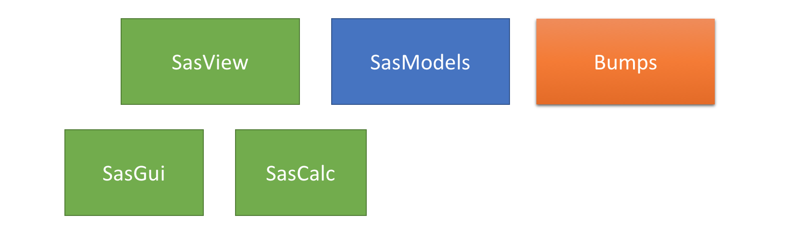

Beyond SasView GUI
==================

## Scripting in SasView
- SasView architecture

- [Dependencies](SasView_dependencies.png)
- SasModels API
  - [Sasmodels components](sasmodels_main_components.png)
  - [Sasmodels components (docs)](https://www.sasview.org/docs/dev/sasmodels-dev/index.html)
  - [Sasmodels API Documentation](https://www.sasview.org/docs/dev/sasmodels-api/modules.html)  
- Jupyter notebooks
  - [Detailed Introduction](https://github.com/ess-dmsc-dram/python-course-ikon/blob/master/notebooks/1_jupyter_basics/jupyter-notebook-intro.ipynb) 
  - [Jupyter-Lab](https://github.com/jupyterlab/jupyterlab-desktop)
  - [Anaconda](https://www.anaconda.com/products/individual)
- [Running sasview on computer cluster](https://github.com/SasView/sasmodels/blob/master/example/slurm_batch.py)
## Exercises
- **Please download and install [Anaconda](https://www.anaconda.com/products/individual) and make sure you can access Anaconda Navigator if you want to follow exercises**
- Installing required packages
- Compute sasmodel model
- Simple fitting with sasmodels and bumps
- P(r) calculation
- Batch fitting 
- [More examples](https://github.com/caitwolf/sas-torials/blob/main/mini_tutorials/) (Credit Caitlyn Wolf)

## Becoming SasView developer
- Setting up developers environment 
  - [Conda enviroment](https://github.com/SasView/sasview/wiki/DevNotes_DevEnviroment)
- Accounts and emails
  - Github and slack  account 
- IDEs
  - [Pycharm](https://www.jetbrains.com/pycharm/)
  - [Vs Code](https://code.visualstudio.com/)
- Github workflow
  - [Introduction](https://github.com/SasView/documents/blob/master/Training/New_Contributor_Training/presentations/IntroductionToGit.pdf) (Credit Paul Butler)
  - Good first issue
  - Creating branch
  - Creating PR
- Where to start coding particular functionality
  - [GUI - code maping](https://github.com/SasView/documents/blob/master/Training/New_Contributor_Training/presentations/CodingBeyondTheModels.pdf) (Credit Jeff Krzywon)
